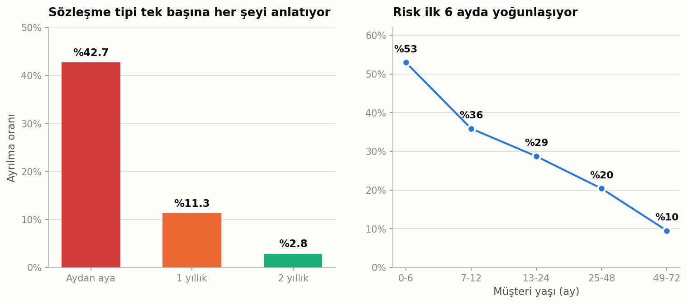
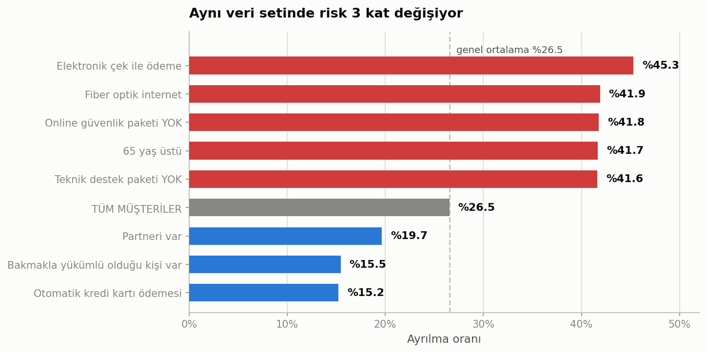
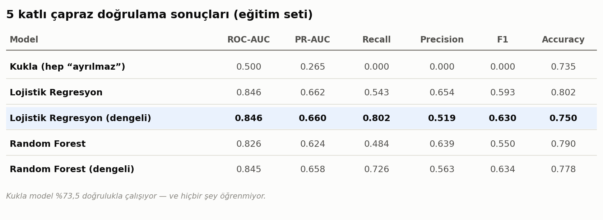
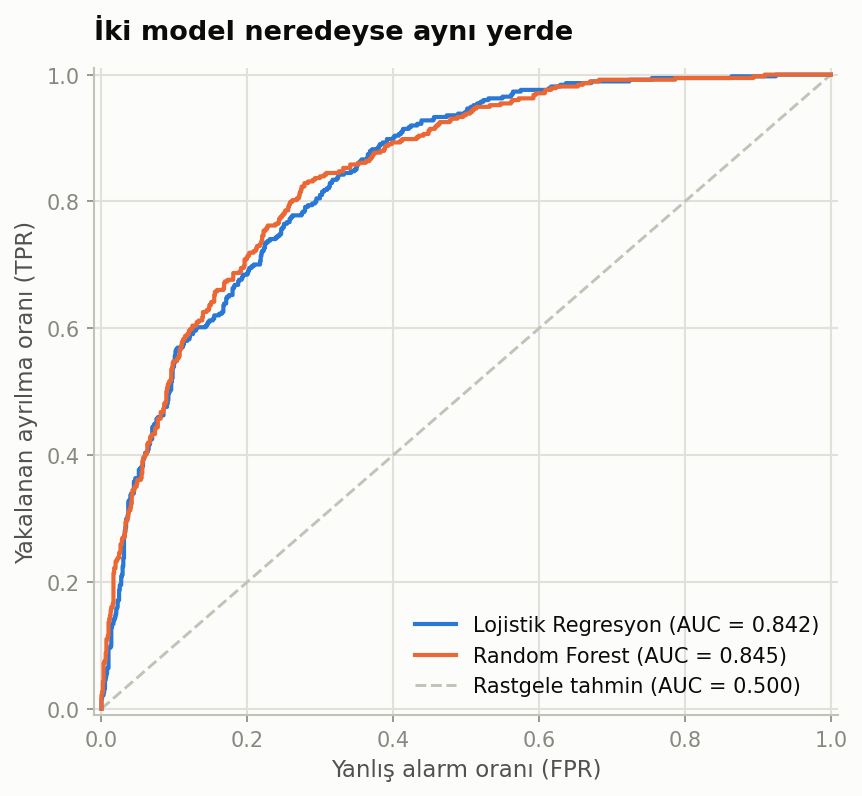
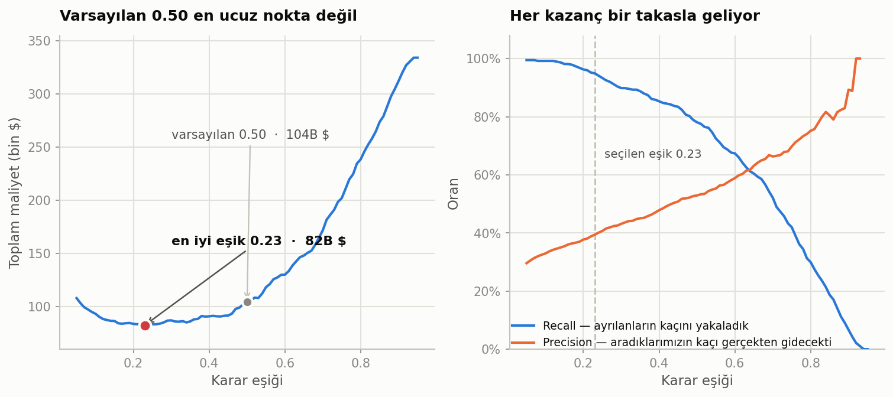
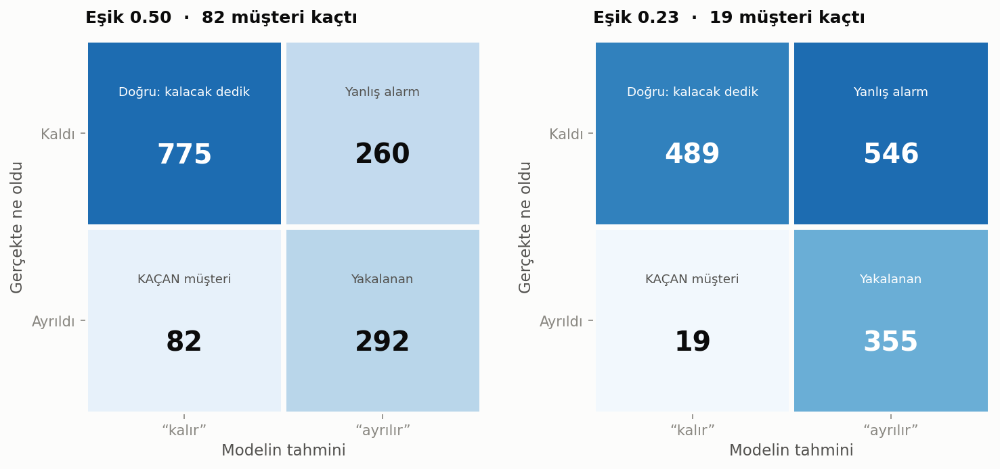
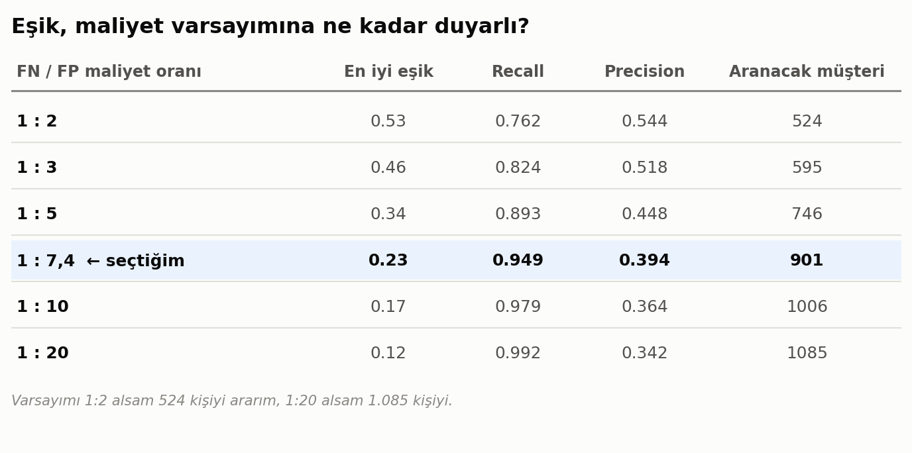
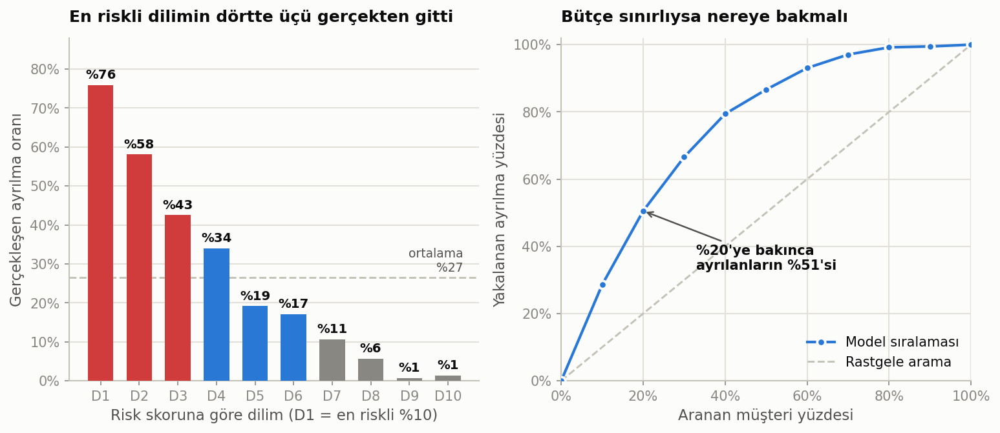
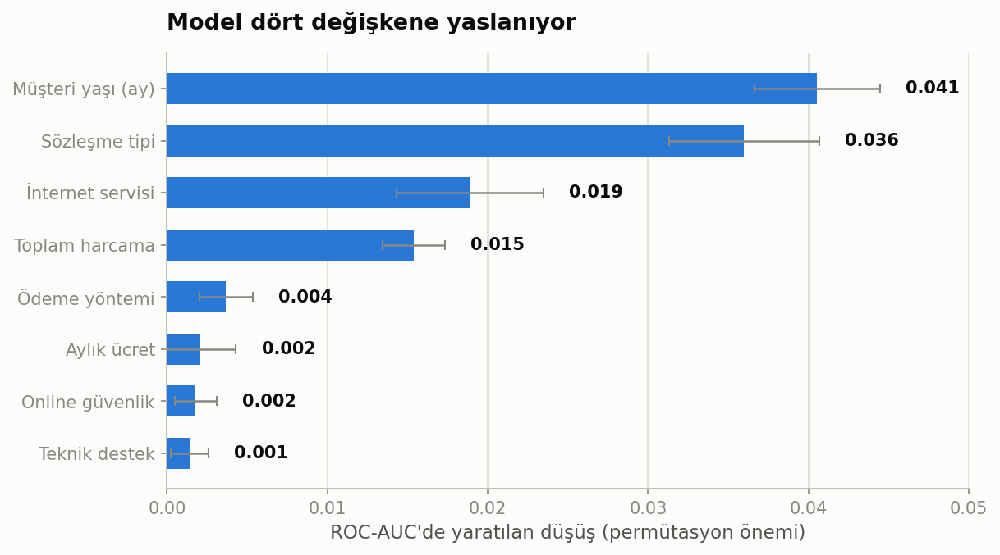
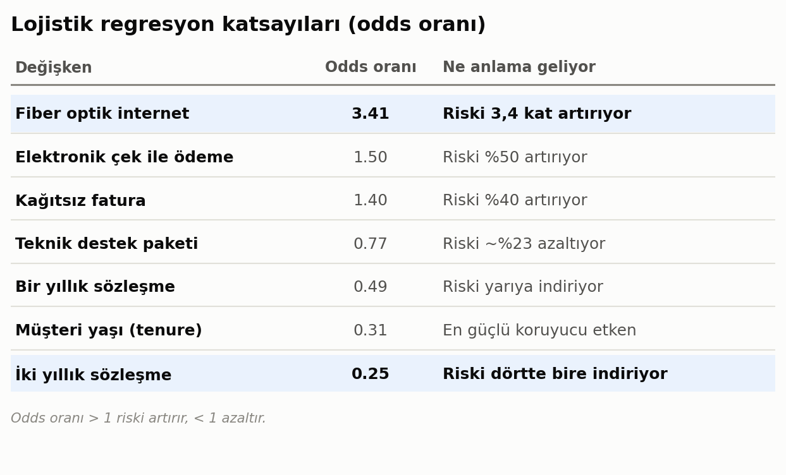

# Telco Müşteri Kaybı (Churn) Tahmini

Bu projede, bir telekom şirketine ait **7.043 müşteri** üzerinden müşteri kaybı (churn) tahmini gerçekleştirilmiştir.

Çalışmada keşifsel veri analizi, veri ön işleme, Lojistik Regresyon ve Random Forest modellerinin karşılaştırılması, model değerlendirme metrikleri, karar eşiği optimizasyonu ve operasyonel churn analizi ele alınmıştır.

Projenin temel bulgularından biri, yalnızca daha karmaşık bir model seçmenin değil, **doğru karar eşiğinin belirlenmesinin de churn tespit performansı üzerinde önemli bir etkiye sahip olduğudur.**

Bu proje, **Türkiye Yapay Zeka Akademisi** ve **HUAWEI Student Developers (HSD) Türkiye** iş birliğiyle düzenlenen **Veri Bilimi ve Makine Öğrenmesi Bootcamp** kapsamında hazırlanmıştır.

## Medium Yazısı

📄 **[Churn Tahmininde En Zor Kısım Model Değil](https://medium.com/@afaruktahsin/churn-tahmininde-en-zor-kısım-model-değil-1dea9df00b50)**

---

## Proje Özeti

- **Problem:** Müşteri kaybı (Customer Churn) tahmini
- **Veri seti:** IBM Telco Customer Churn
- **Gözlem sayısı:** 7.043 müşteri
- **Değişken sayısı:** 21
- **Churn oranı:** %26,5
- **Modeller:** Logistic Regression, Random Forest
- **Ana değerlendirme metriği:** ROC-AUC
- **En yüksek test ROC-AUC:** 0.8455
- **Optimize edilen karar eşiği:** 0.23
- **Araçlar:** Python, pandas, scikit-learn, matplotlib

---

## Özet Bulgular

| Model | ROC-AUC | Test Setinde Kaçan Churn |
|---|---:|---:|
| Lojistik Regresyon (dengeli) | 0.8417 | 81 |
| Random Forest (ayarlı) | **0.8455** | 82 |
| **Random Forest — eşik 0.50 → 0.23** | 0.8455 | **19** |

Lojistik Regresyon ile Random Forest arasındaki ROC-AUC farkı yalnızca **0,004** seviyesindedir.

Buna karşılık aynı Random Forest modelinde karar eşiğinin varsayılan **0.50** seviyesinden maliyet odaklı **0.23** seviyesine düşürülmesi sonucunda **63 ek churn vakası tespit edilmiştir**.

Kullanılan örnek maliyet modeline göre bu yaklaşım yaklaşık **21.939 $** daha düşük tahmini maliyet üretmiştir.

> **Not:** Maliyet değerleri gerçek bir telekom şirketine ait finansal veriler değildir. Bu proje kapsamında karar eşiğinin iş maliyetlerine göre nasıl optimize edilebileceğini göstermek amacıyla kullanılan varsayımsal değerlerdir.

---

## Veri Seti

Projede **IBM Telco Customer Churn** veri seti kullanılmıştır.

🔗 [IBM Telco Customer Churn Dataset](https://github.com/IBM/telco-customer-churn-on-icp4d)

Veri setinde:

- 7.043 müşteri
- 21 değişken
- %26,5 churn oranı

bulunmaktadır.

Veri hazırlama aşamasında `TotalCharges` değişkeninde **11 boş değer** tespit edilmiştir.

Bu müşterilerin tamamının `tenure` değeri 0 olduğundan, söz konusu eksikliklerin yeni müşterilerin henüz ilk faturalarının oluşmamış olmasından kaynaklandığı değerlendirilmiştir.

Bu nedenle ilgili değerler silinmek yerine **0 ile doldurulmuştur**.

---

# Keşifsel Veri Analizi

## Segment Kırılımları



Sözleşme türü churn davranışında önemli bir ayrım oluşturmaktadır.

- Aydan aya sözleşmelilerde churn oranı: **%42,7**
- İki yıllık sözleşmelilerde churn oranı: **%2,8**
- İlk 6 aylık müşterilerde churn oranı: **%52,9**
- 4 yılı aşan müşterilerde churn oranı: **%9,5**

---



Bazı dikkat çekici segmentler:

- Fiber optik kullanan müşteriler: **%41,9 churn**
- Elektronik çek kullanan müşteriler: **%45,3 churn**
- Otomatik kredi kartı ödemesi kullanan müşteriler: **%15,2 churn**

Cinsiyet değişkeninde ise kadınlar ve erkekler arasında belirgin bir churn farkı görülmemiştir.

- Kadınlar: **%26,9**
- Erkekler: **%26,2**

Bu nedenle cinsiyet değişkeninin churn açısından güçlü bir ayırt edici sinyal taşımadığı görülmüştür.

---

# Model Karşılaştırması



Veri setinde churn sınıfı azınlıkta olduğu için yalnızca accuracy metriğine güvenmek yanıltıcı olabilir.

Örneğin, tüm müşterileri "ayrılmaz" olarak tahmin eden basit bir model yaklaşık **%73,5 accuracy** elde edebilmektedir.

Bu nedenle model değerlendirmesinde özellikle:

- ROC-AUC
- Recall
- Precision
- Confusion Matrix

metrikleri dikkate alınmıştır.

`class_weight="balanced"` kullanımı ROC-AUC değerini büyük ölçüde değiştirmemiş ancak churn sınıfı için recall değerini artırmıştır.

---

## ROC Eğrisi



Random Forest modeli test setinde **0.8455 ROC-AUC** değerine ulaşmıştır.

Bu sonuç, modelin churn eden ve etmeyen müşterileri risk skoruna göre ayırmada güçlü bir performans gösterdiğini ortaya koymaktadır.

---

# Karar Eşiği Optimizasyonu

Model çıktılarında varsayılan karar eşiği genellikle **0.50** olarak kullanılmaktadır.

Ancak gerçek iş problemlerinde yanlış negatif ve yanlış pozitif tahminlerin maliyetleri eşit olmayabilir.

Bu nedenle churn tahmininde yalnızca model performansı değil, **karar eşiğinin iş maliyetlerine göre ayarlanması** da incelenmiştir.



Kullanılan varsayımsal maliyet modelinde:

- Kaçırılan churn müşterisi maliyeti: yaklaşık **893 $**
- Gereksiz teklif maliyeti: yaklaşık **120 $**

olarak ele alınmıştır.

Bu varsayımlar altında maliyet açısından uygun karar eşiği yaklaşık **0.23** olarak bulunmuştur.

---

## Confusion Matrix Karşılaştırması



Varsayılan 0.50 eşiğinde model daha az müşteriyi churn olarak işaretlerken, 0.23 eşiğinde daha fazla riskli müşteri tespit edilmektedir.

Bu sayede kaçırılan churn vakası sayısı:

**82 → 19**

seviyesine düşmektedir.

Bu durum karar eşiğinin modelin operasyonel kullanımında ne kadar önemli olabileceğini göstermektedir.

---

## Maliyet Varsayımı Duyarlılığı



Maliyet oranı değiştikçe optimum karar eşiği ve temas kurulacak müşteri sayısı da değişmektedir.

Örneğin:

- Maliyet oranı 1:2 olduğunda yaklaşık **524 müşteri**
- Maliyet oranı 1:20 olduğunda yaklaşık **1.085 müşteri**

ile iletişime geçilmesi önerilmektedir.

Bu nedenle "kaç müşteriye ulaşmalıyız?" sorusunun cevabı yalnızca makine öğrenmesi modelinden değil, aynı zamanda şirketin churn ve kampanya maliyetlerinden etkilenmektedir.

---

# Operasyonel Kullanım

## Desil / Lift Analizi



Model tarafından en riskli olarak sıralanan müşteriler incelendiğinde:

- En riskli **%10'luk** segmentte churn oranı: **%75,9**
- Lift değeri: **2,86**
- En riskli **%20** hedeflendiğinde toplam churn vakalarının yaklaşık **%50,5'i**
- En riskli **%30** hedeflendiğinde yaklaşık **%66,6'sı**

yakalanabilmektedir.

Bu yaklaşım, sınırlı müşteri elde tutma bütçesine sahip ekiplerin en riskli müşterilere öncelik vermesine yardımcı olabilir.

---

# Model Yorumlanabilirliği

## Permütasyon Önemi



Permütasyon önemi analizi, model tahminlerinde hangi değişkenlerin daha fazla katkı sağladığını incelemek için kullanılmıştır.

---

## Lojistik Regresyon Katsayıları



Dikkat çekici sonuçlardan biri `MonthlyCharges` değişkeninin model katsayısının negatif olmasıdır.

Ham veride churn eden müşterilerin ortalama aylık ödemeleri daha yüksek olmasına rağmen, diğer değişkenler kontrol edildiğinde bu ilişkinin yönü değişebilmektedir.

Bu durum özellikle:

`InternetService_Fiber optic`

gibi aylık ücretle ilişkili kategorik değişkenlerin modele aynı anda dahil edilmesiyle ortaya çıkan **çoklu değişken etkisinin** bir sonucudur.

Bu nedenle lojistik regresyon katsayıları tek başına ham korelasyon gibi yorumlanmamalıdır.

---

# Çalıştırma

Gerekli Python paketlerini yüklemek için:

```bash
pip install -r requirements.txt


## Kod Akışı

Proje kodları aşağıdaki sırayla çalıştırılabilir:

```text
01_kesif.py          → Keşifsel veri analizi ve veri hazırlama
02_model.py          → Lojistik Regresyon ve Random Forest modelleri
03_duyarlilik.py     → Karar eşiği ve maliyet duyarlılık analizi
04_grafikler.py      → Görselleştirmeler
05_dogrulama.py      → Model doğrulama ve test sonuçları
06_tablolar.py       → Sonuç tablolarının oluşturulması
07_html_uret.py      → HTML rapor çıktısı üretimi
```
