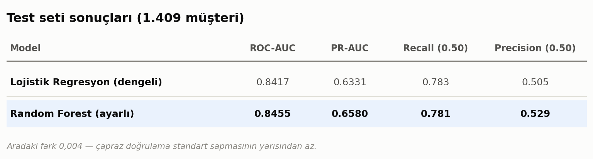

# Churn Tahmininde En Zor Kısım Model Değil

### Random Forest, lojistik regresyonu 0,004 AUC farkla geçti. Asıl fark, karar eşiğine dokunduğumda ortaya çıktı.

---

Bootcamp boyunca öğrendiğim yöntemleri tek bir problemde birleştirmek istedim ve müşteri kaybı (churn) tahminini seçtim. Klasik bir konu, biliyorum. Ama üzerinde çalışırken beklemediğim bir şey oldu: işin zor kısmı model kurmak değilmiş. Zor kısım, model bir olasılık ürettikten sonra o olasılıkla ne yapacağına karar vermekmiş.

Bu yazıda projeyi baştan sona anlatacağım — veriyi tanımaktan başlayıp, iki farklı modeli karşılaştırıp, sonunda "peki bu skoru sahada nasıl kullanırız" sorusuna kadar. Yol boyunca beni yanıltan birkaç şeyi de olduğu gibi yazdım, çünkü asıl öğrendiğim kısımlar oralarda.

**Kullandığım yöntemler:** Lojistik Regresyon ve Random Forest.
**Veri seti:** IBM Telco Customer Churn (7.043 müşteri, 21 değişken).

---

## Problem neden önemli

Telekom sektöründe müşteri kaybı sürekli akan bir musluk gibi. Yeni müşteri kazanmanın maliyeti, mevcut müşteriyi elde tutmanın maliyetinden kat kat yüksek. Yani şirketin gerçek sorusu şu: **kim gitmek üzere ve ben kime, ne zaman dokunmalıyım?**

Veriye baktığımda bu sorunun büyüklüğü somutlaştı. Veri setindeki 7.043 müşterinin toplam aylık geliri 456.117 dolar. Bunun 139.131 doları, yani **%30,5'i**, ayrılan müşterilerden geliyor. Her ay gelirin neredeyse üçte biri kapıdan çıkıyor.

Bu, üzerinde çalışmaya değer bir sayı.

---

## Veriyi tanımak: model kurmadan önce yarım gün

Buraya sabırla yaklaşmanın karşılığını aldığımı söyleyebilirim. Veri setinde 7.043 satır, 21 sütun var. Hedef değişken `Churn` — müşteri son dönemde ayrıldı mı, ayrılmadı mı.

İlk kontrol: sınıf dengesi.

```python
df["Churn"].value_counts(normalize=True)
# No     0.7346
# Yes    0.2654
```

Müşterilerin **%26,5'i ayrılmış**. Dengesiz, ama korkutucu derecede değil. Yine de bu oran ileride başımı ağrıtacaktı — birazdan geleceğim.

`isnull()` çektiğimde hiç eksik değer görünmedi. Ama `TotalCharges` sütununun tipi `object`'ti; sayısal olması gereken bir sütun neden metin olarak duruyor?

```python
bos = df["TotalCharges"].astype(str).str.strip() == ""
print(bos.sum())   # 11
print(df.loc[bos, "tenure"].unique())   # [0]
```

11 satırda boşluk karakteri varmış — ve **hepsinin `tenure` değeri 0**. Yani bunlar daha ilk faturası kesilmemiş, yeni kaydolmuş müşteriler. Rastgele bir eksiklik değil, verinin anlattığı bir durum. Silmek yerine 0 yazdım; toplam harcaması gerçekten 0.

Bu, üzerine düşünmeye değer bir ayrıntıydı. `dropna()` çekip geçseydim aynı sonuca varırdım (11 satır, 7.043 içinde hiçbir şey), ama neden eksik olduklarını hiç öğrenemeyecektim.

### Sonra kırılımlara baktım

Burası projenin en keyifli kısmıydı, çünkü model kurmadan önce cevabın büyük bir bölümü zaten gözüküyordu.


Sözleşme tipi tek başına neredeyse her şeyi anlatıyor. Aydan aya sözleşmeli müşterilerin **%42,7'si** ayrılırken, iki yıllık sözleşmelilerde bu oran **%2,8**. On beş kattan fazla fark.

Müşteri yaşında da aynı netlik var: ilk 6 ayındaki müşterilerin %52,9'u gidiyor, 4 yılı devirenlerde oran %9,5'e iniyor. İlişki ilerledikçe risk düşüyor — sezgisel, ama veride bu kadar temiz görmek yine de tatmin edici.

Diğer kırılımlar da benzer şekilde konuşkandı:


Birkaç not:

- **Fiber optik internet kullananların %41,9'u ayrılıyor**, DSL kullananların %19'u. Bu ilk bakışta tuhaf — fiber daha iyi bir ürün. Muhtemelen daha pahalı, daha rekabetçi bir segment ve beklenti daha yüksek. Ya da fiber müşterisi zaten fiyat karşılaştırması yapmaya alışkın bir profil.
- **Elektronik çekle ödeyenlerde oran %45,3**; otomatik kredi kartı talimatı verenlerde %15,2. Otomatik ödeme talimatı bir tür sürtünme yaratıyor: ayrılmak için aktif bir hamle yapmanız gerekiyor.
- **Teknik destek veya online güvenlik paketi olmayanlarda oran %41'in üzerinde**, olanlarda %15 civarı. Ek hizmetler müşteriyi bağlıyor gibi görünüyor.

Ve en sevdiğim bulgu — cinsiyet:

```
gender
Female  26.9%
Male    26.2%
```

**Hiçbir şey.** 0,7 puanlık bir fark, 7.000 kişilik bir örneklemde gürültüden ibaret. Elimizde bir sütun olması onun bir sinyal taşıdığı anlamına gelmiyor. Modele yine de verdim (zarar vermiyor, kendi ağırlığını sıfıra yakın seçecektir), ama "her değişken bir özelliktir" varsayımının ne kadar yanlış olduğunu hatırlatan iyi bir örnek oldu.

---

## Veri hazırlığı

Kararlar sade ama üzerine düşünülmüş olsun istedim:

**1. `customerID`'yi attım.** Her satırda benzersiz bir kimlik; modele verirsem gürültüden başka bir şey öğretmez.

**2. Ölçekleme ve kodlama işini pipeline'a taşıdım.** Bunu en baştan yapmak, çapraz doğrulamada sızıntı riskini tamamen ortadan kaldırdı. Eğer `StandardScaler`'ı tüm veriye baştan uygularsanız, test setinin ortalaması eğitim aşamasına sızar. Pipeline bunu her kat için ayrı ayrı halleder.

```python
sayisal = ["tenure", "MonthlyCharges", "TotalCharges", "SeniorCitizen"]
kategorik = [c for c in X.columns if c not in sayisal]

on_isleme = ColumnTransformer([
    ("say", StandardScaler(), sayisal),
    ("kat", OneHotEncoder(drop="first", handle_unknown="ignore"), kategorik),
])
```

**3. Bölme işlemini `stratify` ile yaptım.** %80 eğitim (5.634 müşteri), %20 test (1.409 müşteri). Her iki tarafta da churn oranı 0,2654 — birebir korundu.

**4. Bir korelasyon uyarısını not ettim.**

```
                tenure  MonthlyCharges  TotalCharges
tenure           1.000           0.248         0.826
MonthlyCharges   0.248           1.000         0.651
TotalCharges     0.826           0.651         1.000
```

`TotalCharges` ile `tenure` arasında 0,83 korelasyon var — mantıklı, çünkü toplam harcama kabaca "aylık ücret × kaç ay kaldığı". Bu, ağaç tabanlı modelleri pek rahatsız etmez ama lojistik regresyonun katsayılarını yorumlarken dikkatli olmam gerektiği anlamına geliyordu. Yazının sonunda tam olarak bu yüzden kafamı karıştıran bir katsayı çıkacak.

---

## Önce bir taban çizgisi: doğruluk tuzağı

Modelleri kurmadan önce en aptal tahminciyi koydum: herkese "ayrılmaz" diyen bir model.

```
Kukla (hep 'ayrılmaz')   accuracy = 0.7346   recall = 0.0   ROC-AUC = 0.500
```

**%73,5 doğruluk.** Hiçbir şey öğrenmeden.

Bu satırı gördüğümde projenin geri kalanına bakışım değişti. Eğer "modelim %75 doğrulukla çalışıyor" diye bir cümle kurup bıraksaydım, aslında rastgele tahminden bir gömlek iyi bir şey yapmış olacaktım. Dengesiz sınıflarda doğruluk (accuracy) ölçüsü işe yaramaz; kandırır.

Bundan sonra ana metriğim **ROC-AUC** ve **recall** oldu — özellikle recall, çünkü iş tarafında asıl acıtan hata, gidecek müşteriyi kaçırmak.

---

## Modeller ve çapraz doğrulama

Eğitim seti üzerinde 5 katlı stratified cross-validation kurdum. Beş yapılandırma denedim:


Bu tablodan üç şey öğrendim.

**Birincisi: `class_weight="balanced"` ROC-AUC'yi değiştirmiyor.** Lojistik regresyonda 0.8462'den 0.8460'a — hiç. Ama recall 0.543'ten 0.802'ye fırlıyor. Sınıf ağırlıklandırması modelin *sıralama* yeteneğini iyileştirmiyor; sadece kesme noktasını kaydırıyor. Bunu ilk fark ettiğimde biraz hayal kırıklığına uğradım, sonra bunun aslında çok öğretici olduğunu düşündüm.

**İkincisi: ayarsız Random Forest, lojistik regresyondan kötü.** 0.826'ya karşı 0.846. Karmaşık model her zaman iyi model değil; varsayılan `RandomForestClassifier` bu boyuttaki bir veri setinde rahatça ezberliyor.

**Üçüncüsü: standart sapmalar küçük.** Beş katta ROC-AUC'nin standart sapması 0.010–0.013 arasında. Yani modeller arasındaki 0.001–0.002'lik farklar gürültü. Bunu bilmek, sonraki adımda kendimi gereksiz yere kutlamamı engelledi.

### Hiperparametre araması

Random Forest'a bir şans daha verdim ve `GridSearchCV` ile 18 kombinasyon denedim:

```python
grid = GridSearchCV(
    pipeline,
    {"mdl__n_estimators": [300, 600],
     "mdl__max_depth": [6, 10, None],
     "mdl__min_samples_leaf": [1, 5, 15]},
    scoring="roc_auc", cv=cv, n_jobs=-1)
```

En iyi kombinasyon: `max_depth=10`, `min_samples_leaf=15`, `n_estimators=300`. Çapraz doğrulama ROC-AUC'si **0.8475**.

Dikkat: kazanan yapılandırma, ağaçları *kısıtlayan* yapılandırma. Derinlik sınırı ve yaprak başına minimum 15 örnek — yani "daha az ezberle" demek. Ayarsız halinden 0.02 puan kazandırdı.

---

## Test seti: gerçek an

Model seçimini bitirdikten sonra, o güne kadar hiç dokunmadığım 1.409 müşterilik test setini açtım.




Random Forest kazandı — **0,004 AUC farkla**. Çapraz doğrulamadaki standart sapmanın (0,010) yarısından az bir fark. Dürüst olmak gerekirse bu bir beraberlik.

Ve burada durup şunu yazmak istiyorum: **projenin en anlamlı kısmı bu tablo değildi.** İki model de aynı yerde. Eğer proje burada bitseydi, elimde "AUC 0.85, fena değil" cümlesi olacaktı ve bunun iş tarafında hiçbir karşılığı olmayacaktı.

---

## Asıl mesele: 0.50 nereden geliyor?

`predict()` çağırdığınızda scikit-learn size 0.50 eşiğiyle üretilmiş bir tahmin veriyor. Bu sayı nereden geliyor? Hiçbir yerden. Varsayılan, o kadar.

0.50 eşiği şu varsayımı yapar: *yanlış alarm ile kaçırılan müşteri eşit derecede pahalıdır.* Churn probleminde bu apaçık yanlış. Gitmek üzere olan bir müşteriyi kaçırmak, kalacak bir müşteriye gereksiz indirim teklif etmekten çok daha pahalı.

Basit bir maliyet modeli kurdum:

- **Kaçırılan müşteri (FN):** Ayrılan müşterilerin ortalama aylık geliri 74,44 dolar. 12 aylık kayıp ≈ **893 dolar**.
- **Gereksiz teklif (FP):** İki ay %50 indirim + operasyon maliyeti ≈ **120 dolar**.

Oran yaklaşık **1:7,4**. Sonra tüm eşikleri tarayıp toplam maliyeti hesapladım.


En düşük maliyet **0.23 eşiğinde**. Varsayılan 0.50'de test setinin toplam maliyeti 104.426 dolar; 0.23'te 82.487 dolar. **21.939 dolar fark** — sadece 1.409 kişilik bir test setinde, tek satır kod değiştirerek.

Somut olarak ne değişti:


0.50'de 82 müşteri elimizden kaçıyordu. 0.23'te bu sayı **19'a** düşüyor. Recall 0.78'den 0.95'e çıkıyor.

Bedeli var tabii: precision 0.53'ten 0.39'a iniyor. Yani aradığımız her 10 kişiden 6'sı zaten kalacaktı. Ama varsayımlarımıza göre bu bedel, kaçırdığımız 63 müşteriden ucuz.

### Ama bu varsayımlar ne kadar sağlam?

Burada kendimi biraz rahatsız hissettim, çünkü 893 ve 120 sayılarını ben uydurdum. Gerçek bir projede bunlar finans ekibinden gelirdi. O yüzden eşiğin bu varsayımlara ne kadar duyarlı olduğuna baktım:


Tablo bana şunu söyledi: eşik, maliyet varsayımına **çok** duyarlı. Oranı 1:2 alsam 524 kişiyi ararım, 1:20 alsam 1.085 kişiyi — neredeyse test setinin tamamını.

Bu bir zayıflık değil, modelin doğru soruyu iş tarafına geri vermesi. "Kaç kişiyi arayalım?" sorusunun cevabı modelde değil; bir müşterinin kaybının şirkete gerçekte neye mal olduğunda.

---

## Peki bütçe sınırlıysa?

Gerçek hayatta elde tutma ekibinin kapasitesi sınırlı. "1.409 kişiden 901'ini arayın" pek gerçekçi bir öneri değil. Bu yüzden müşterileri risk skoruna göre sıralayıp on dilime böldüm.


En riskli %10'luk dilimde (D1) müşterilerin **%75,9'u gerçekten ayrılmış**. Genel ortalama %26,5 olduğuna göre bu **2,86 kat lift** demek.

Kümülatif olarak bakınca tablo daha da net:

- En riskli **%20**'yi ararsanız → ayrılacakların **%50,5'ini** yakalarsınız
- En riskli **%30**'u ararsanız → **%66,6'sını**
- En az riskli %20'de (D9 + D10) 282 müşteriden yalnızca **3'ü** ayrılmış

Bence projenin en kullanışlı çıktısı bu. Elde tutma ekibine "şu 280 kişiyi ara" demek, "%84 AUC'lik bir modelimiz var" demekten çok daha somut bir şey.

---

## Model ne öğrendi — ve beni yanıltan katsayı

İki farklı açıdan baktım.

**Random Forest tarafında permütasyon önemi** (test setinde, bir değişkeni karıştırınca ROC-AUC ne kadar düşüyor):


Model neredeyse tamamen dört değişkene yaslanıyor: müşteri yaşı, sözleşme tipi, internet servisi ve toplam harcama. Bu dördünün toplam katkısı 0,111; geriye kalan 15 değişkenin **hepsi birlikte** 0,014. Yani sekizde bir kadar.

**Lojistik regresyon tarafında katsayılar** (odds oranı olarak):


İki yöntem aynı hikâyeyi anlatıyor: **sözleşme uzunluğu ve müşteri yaşı koruyucu, fiber optik ve elektronik çek riskli.**

Ama bir satır beni durdurdu:

```
say__MonthlyCharges    katsayi = -0.555    odds_orani = 0.574
```

Aylık ücretin katsayısı **negatif**. Yani modele göre aylık ücret arttıkça ayrılma riski *azalıyor*.

Bu, ham veriye tamamen ters. Ayrılan müşterilerin ortalama aylık ücreti 74,44 dolar, kalanların 61,27 dolar. Yani daha çok ödeyen daha çok ayrılıyor. Peki model neden tersini söylüyor?

Cevap, daha önce not ettiğim korelasyonda. Modelde `InternetService_Fiber optic` diye ayrı bir değişken var ve fiber pahalı bir ürün. Fiber optik değişkeni "yüksek ücret + yüksek risk" ilişkisini zaten üzerine almış durumda. Geriye kalan `MonthlyCharges` etkisi ise şunu ölçüyor: *aynı internet servisini kullanan iki müşteriden daha çok ödeyen* — yani daha çok ek hizmet alan, ürüne daha çok bağlanmış olan — müşteri, aslında daha az ayrılıyor.

Katsayı yanlış değil. Ben yanlış okuyordum. Çok değişkenli bir modelde her katsayı "diğer her şey sabitken" anlamına geliyor ve değişkenler birbiriyle ilişkiliyse bu "sabitken" şartı sezgiye aykırı sonuçlar üretebiliyor.

Bu, projede en çok vakit harcadığım ve en çok şey öğrendiğim yer oldu.

---

## Dürüst olmak gerekirse: bu çalışmanın sınırları

Yazıyı bitirmeden önce, elimdeki sonucun ne olmadığını da yazmak istiyorum.

**1. Veri kesitsel, zamansal değil.** Veri setinde tarih yok. Yani "bu müşteri önümüzdeki ay gidecek mi" sorusunu cevaplayamıyorum; ancak "bu müşteri, ayrılmış müşterilere ne kadar benziyor" diyebiliyorum. Gerçek bir üretim modelinde zamana göre bölme (geçmiş ay ile eğit, sonraki ay ile test et) yapmak gerekirdi. Rastgele bölme, gerçekte olduğundan iyimser bir tablo çiziyor olabilir.

**2. Korelasyon nedensellik değil.** İki yıllık sözleşmeliler daha az ayrılıyor. Bu, herkesi iki yıllık sözleşmeye geçirirsek churn düşecek demek değil — zaten sadık olmaya niyetli müşteriler uzun sözleşme imzalıyor olabilir. Sözleşmenin gerçekten sadakat *yarattığını* iddia etmek için A/B testi gerekir.

**3. Maliyet varsayımları benim.** 893 ve 120 dolar tahminî sayılar. Duyarlılık tablosunu bu yüzden ekledim.

**4. Tek bir bölme.** Test sonuçları tek bir %20'lik ayırmadan geliyor. Farklı bir `random_state` ile ROC-AUC muhtemelen ±0,01 oynardı. Çapraz doğrulama standart sapmaları da bunu söylüyor.

**5. Kalibrasyon kontrolü yapmadım.** "0,23 olasılık" gerçekten %23'lük bir risk mi, yoksa sadece bir sıralama skoru mu? Random Forest olasılıkları genelde iyi kalibre olmaz. Sıralama için sorun değil ama maliyet hesabını doğrudan olasılıklar üzerinden kurmak isteseydim `CalibratedClassifierCV` ile bakmam gerekirdi.

---

## Devam etseydim ne yapardım

- **Gradient boosting** (XGBoost / LightGBM) denerdim — bu veri boyutunda genelde birkaç puan getirir.
- **SHAP değerleri** ile müşteri bazında açıklama üretirdim. Elde tutma ekibi için "bu müşteri riskli" yetmez; "çünkü aydan aya sözleşmeli ve teknik desteği yok" lazım.
- **Olasılık kalibrasyonu** eklerdim.
- Ve en önemlisi: gerçek maliyet rakamlarını iş tarafından alırdım.

---

## Kapanış

Bu projeye "hangi model daha iyi tahmin eder" sorusuyla başlamıştım. Bitirdiğimde elimde bambaşka bir cevap vardı.

İki model arasındaki fark 0,004 AUC — ölçüm gürültüsü. Ama aynı modelin eşiğini 0.50'den 0.23'e çekmek, test setinde 63 müşteriyi kurtardı ve varsayımlarıma göre 22 bin dolar tasarruf ettirdi. **Model seçimi bana neredeyse hiçbir şey kazandırmadı; karar eşiği her şeyi kazandırdı.**

Bootcamp boyunca `fit()` ve `predict()` arasındaki kısmı öğrendim. Bu projede asıl işin `predict()`'ten *sonra* başladığını öğrendim.

Aklımda kalan üç cümle:

1. **Doğruluk (accuracy) dengesiz veride yalan söyler.** Hiçbir şey yapmayan modelim %73,5 doğrulukla çalışıyordu.
2. **Basit model çoğu zaman yeter.** Ayarlı Random Forest, lojistik regresyonu ölçüm hatası kadar geçti — ama lojistik regresyonun katsayıları okunabilir.
3. **Modelin çıktısı bir karar değil, bir olasılık.** O olasılığı karara çevirmek istatistik değil, iş bilgisi gerektiriyor.

---

*Projenin kodları ve grafikleri GitHub'da: [repo linkinizi buraya ekleyin]*

*Veri seti: IBM Telco Customer Churn — 7.043 müşteri, 21 değişken.*
